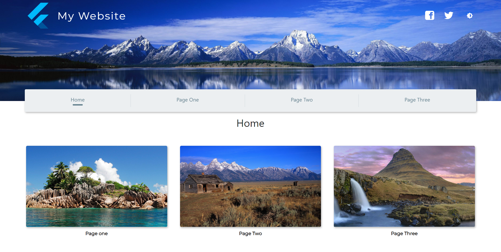
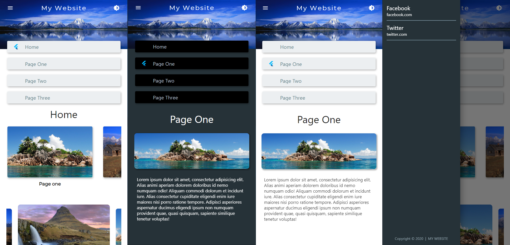

# My Website

A basic Flutter website.

This project is a starting point for a Flutter website.
It is a responsive website with dark/light theme and links to social media.

Original project:

sbis04: [github.com/sbis04/explore](https://github.com/sbis04/explore)
Explore sample: [sbis04.github.io/explore](https://sbis04.github.io/explore)

This project:

My Website: [linchoplus.github.io/mywebsite](https://linchoplus.github.io/mywebsite)

The main differences from the original project:

- **Navigation (named routes)** - It allows to navigate directly to a page other than the home page.
- **Social Media Links** - Clickable logos to various social media pages.
- **Screen Transitions** - Fade transition between screens/pages and added some Hero images to make it cooler.
- **Cleaner Code** - Settings folder created with all constants, variables and settings (easier to change/add links, logos, text, images, etc.).

Check it out:

- [My Website](https://linchoplus.github.io/mywebsite)
- [Lincho Plus](https://linchoplus.com)

### Screenshots

